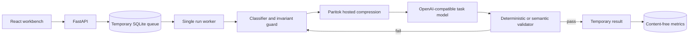

# Architecture

## System boundaries

The application has two outbound hosts, both fixed by deployment configuration:
PariTok and the final task-model provider. User input cannot select an arbitrary URL
or model.

## Run lifecycle

1. The API validates body shape, size, production Turnstile, and quotas.
2. A signed anonymous session owns the random run ID.
3. The API writes a queued job with a short expiration timestamp.
4. The worker claims one job atomically; interrupted `running` jobs return to
   `queued` during startup.
5. Comparison mode calls the baseline once with original context.
6. Each optimized attempt classifies and compresses segments, restores invariant
   failures, calls the same task model, and validates the answer.
7. A failed curated answer retries at a safer level. Original fallback reuses the
   comparison baseline rather than billing the same request twice.
8. Completion clears the queued input, writes the temporary result, and records only
   aggregate numeric metrics in the durable table.
9. The janitor deletes the complete or failed job at its TTL.

## Why a monolith

The demo needs one public URL, low operational overhead, and inspectable behavior
more than horizontal scale. A single worker also makes global API-budget enforcement
and SQLite ownership straightforward. Moving to multiple replicas would require
Postgres plus a distributed queue and rate limiter.

## Failure behavior

- PariTok authorization, timeout, or transport failures fail the run explicitly;
  they are not misreported as compression.
- A healthy PariTok endpoint with `gpu_available=false` becomes a visible
  pass-through decision.
- Provider failures are sanitized before reaching the job record.
- Critical-span loss restores only the affected segment before model execution.
- Failed task validators make context less aggressive, then restore the original.
